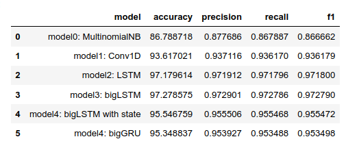
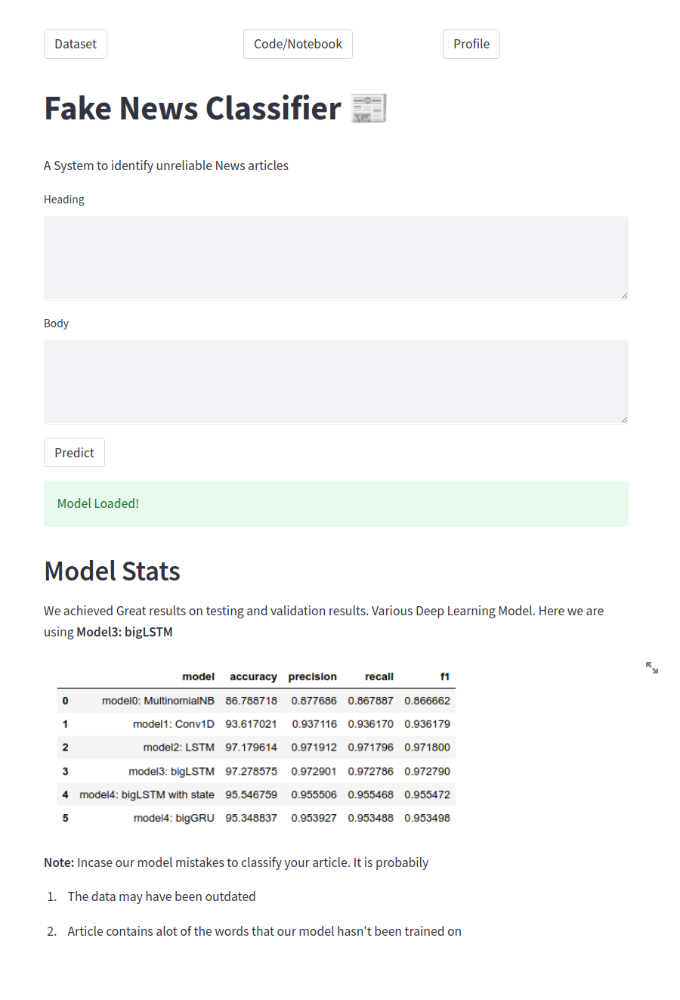

# FAKE NEWS CLASSIFIER : Build a system to identify unreliable news articles
Aim is to Develop a machine learning program to identify when an article might be fake news. Run by the UTK Machine Learning Club.

## Dataset Description
[Dataset Here](https://www.kaggle.com/competitions/fake-news/code)

**train.csv** : A full training dataset with the following attributes:

* id: unique id for a news article

* title: the title of a news article

* author: author of the news article

* text: the text of the article; could be incomplete

* label: a label that marks the article as potentially unreliable

    1: unreliable

    0: reliable

## Model Stats
We achieved Great results on testing and validation results. Various Deep Learning Model. Here we are using **Model3: bigLSTM**

## Model app Screenshot
